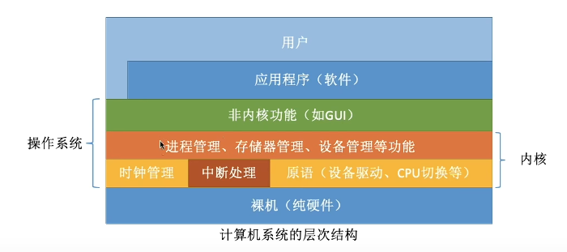

# 操作系统概念

## 操作系的概念

操作系统是指控制和管理整个计算机系统的硬件和软件资源，并合理地组织调度计算机的工作和资源的分配；以提供给用户和其他软件方便的接口和环境；它是计算机系统中最基本的系统软件。

提供的功能：处理机管理，存储器管理，文件管理，设备管理
目标：安全、高效

功能：gui

联机命令接口（和电脑交互），脱机命令接口（一次性运行一系列命令），程序接口（如print函数）

## 操作系统的四个特征

四个特征：并发，共享，虚拟，异步

并发：多个事件在同一时间间隔内发生。这些事件宏观上是同时发生的，但是在微观上是交替发生的

并行：指多个事件在同一时刻同时发生

注：单核cpu同一时刻只能执行一个程序，各个程序只能并发的执行

共享：即资源共享，是指系统中的资源可供内存中多个并发执行的进程共同使用。

共享有两种方式：互斥共享方式，同时共享方式（一个时间段内，允许多个进程“同时”对它进行访问）。

虚拟：是指把一个物理上的实体变为若干个逻辑上的对应物。物理实体是实际存在的，而逻辑上对应物是用户感受到的。

异步：是指，在多道程序环境下，允许多个程序并发执行，但由于资源有限，进程的执行不是一贯到底的，而是走走停停，以不可预知的速度向前推进，这就是进程的异步性。

## 操作系统的发展与分类

手工操作系统：在纸带机上打孔输入程序，在这阶段，用户独占全机，资源利用率极低

批处理阶段，单道批处理系统：引入脱机输入/输出技术，并由监督程序负责控制作业的输入输出。缺点；内存中仅能有一道程序运行，cpi有大量时间是在空闲等待io完成

多道批处理系统：操作系统正式诞生。多道程序并发执行，共享计算机资源，资源利用率大幅提升。没有人机交互功能

分时操作系统：计算机以时间片为单位轮流为各个用户作业服务，各个用户可通过终端与计算机进行交互。解决了人机交互问题。但是不能优先处理一些紧急的任务。

实时操作系统：分为硬实时系统和软实时系统。

网络操作系统

分布式操作系统

个人计算机操作系统

## 操作系统的运行机制

## 中断和异常

cpu上会运行两种程序，一种是操作系统内核程序，一种是应用程序。

内中断（异常），外中断（与当前执行的指令无关，中断信号来源于cpu外部）

>中断的分类：内中断：陷阱、故障、终止
            外中断：时钟中断、i/o中断请求

## 系统调用

系统调用是操作系统提供给应用程序使用的接口

系统调用功能：设备管理、文件管理、进程控制、进程通信、内存管理

系统调用的过程：传递系统调用参数、执行陷入指令、执行相应的内请求核程序处理系统调用、返回应用程序

## 操作系统的体系结构

原语：是一种特殊的程序，具有原子性。一气呵成完成，不可被中断

## 操作系统的引导

# 进程管理

## 进程的概念、组成、特征

进程的概念：是动态的，是程序的一次执行过程。

当进程被创建时，操作系统会为进程赋予唯一的id-PID

进程控制块（PCB）：PCB是进程存在的唯一标志，当进程被创建时，操作系统为其创建PCB，当进程结束时，回收PCB。

PCB保存的信息：进程描述信息、进程控制和管理细腻些、资源分配清单、处理相关信息。

进程的组成：PCB、程序段、数据段

程序段：包含程序指令

数据段：包含运行过程中产生的各种数据

进程的特征：动态性、并发性、独立性、异步性、结构性

## 进程的状态

三种基本状态：运行态、就绪态、阻塞态

创建态：进程正在被创建，在这个阶段操作系统会为进程分配资源、初始化PCB

就绪态：进程创建完成后，处于就绪态的进程已经具备运行条件，但由于没有空闲CPU，就暂时不能运行。

运行态：一个进程此时在CPU上运行，CPU会执行该进程对应的程序

阻塞态：在进程运行过程中，可能会请求等待某个实践的发生，在这个事件发生之前，进程无法继续往下执行，此时操作系统会让整个进程下CPU 

执行态：一个进程可以执行exit系统调用，请求操作系统终止该进程。
在这个状态中，系统会回收CPU所有资源，当回收完毕，这个进程就彻底消失了。

注意：不能由阻塞态直接转换为运行态，也不能由就绪态直接转换为阻塞态。

## 进程控制

进程控制：主要功能是对系统中的所有进程实施有效的管理，简单来说就是实现进程状态转换。

### 怎么实现进程控制

原子性：由关中断指令和开中断指令两个特权指令实现的

创建原语：申请空白pcb，为新进程分配所需资源，初始化pcb，将pcb插入就绪队列。

撤销原语：从pcb集合中找到终止进程的PCB，若进程正在运行，立即剥夺cp，将cpu分配给其他进程，终止其所有子进程，将该进程拥有的所有资源归还给父进程或操作系统，删除pcb

阻塞原语和唤醒原语

一个进程因为什么事情阻塞就要因为什么进程唤醒

## 进程通信

进程间通信：是指两个进程之间产生数据交互。

进程是分配系统资源的单位，因此各进程拥有的内存地址空间相互独立。

进程通信：共享存储，消息传递，管道通信。

### 共享存储

共享存储就是一个共享的区域，所有进程都可以进行访问。

### 消息传递（直接通信方式）

### 管道通信

从一端写入数据，从另一端导出数据，

## 信号

信号：用于通知进程某个特定事件已经发生。进程收到一个信号后，对该信号进行处理。

