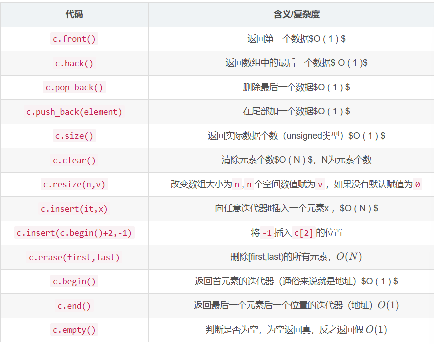

# 哈希表

>https://blog.csdn.net/Yeeear/article/details/141861208?ops_request_misc=%257B%2522request%255Fid%2522%253A%25222c5bd16a28557e7a9f8659ae82d71535%2522%252C%2522scm%2522%253A%252220140713.130102334..%2522%257D&request_id=2c5bd16a28557e7a9f8659ae82d71535&biz_id=0&utm_medium=distribute.pc_search_result.none-task-blog-2~all~top_positive~default-1-141861208-null-null.142^v102^control&utm_term=%E5%93%88%E5%B8%8C&spm=1018.2226.3001.4187

## 两数之和

> 给定一个整数数组 nums 和一个整数目标值 target，请你在该数组中找出 和为目标值 target  的那 两个 整数，并返回它们的数组下标。

>你可以假设每种输入只会对应一个答案，并且你不能使用两次相同的元素。

>你可以按任意顺序返回答案。

暴力解法

这个版本的解法时间复杂度为o（n^2），基本思路是两个for循环嵌套。

```c++
class Solution {
public:
    vector<int> twoSum(vector<int>& nums, int target) {
        for(int i=0;i<nums.size();i++)
        {
            for(int j=i+1;j<nums.size();j++)
            {
                if(nums[i]+nums[j]==target)
                {
                    return{i,j};
                }
            }
        }
        return{};
    }
};
```

哈希表版本

这个版本的解法时间复杂度为o（n），基于基于哈希表寻址的unordered_map容器。

```c++
class Solution {
public:
    vector<int> twoSum(vector<int>& nums, int target) {

        unordered_map<int,int> hashmap;

        for(int i=0;i<nums.size();i++)
		{
			int number=target-nums[i];
			if(hashmap.find(number)!=hashmap.end())
			{
				return {hashmap[number],i};
			}
			
			hashmap[nums[i]] = i;
		 } 
         return{};
    }
};

```

## 罗马数字转整数

>罗马数字包含以下七种字符: I， V， X， L，C，D 和 M。

>字符          数值
I             1
V             5
X             10
L             50
C             100
D             500
M             1000
例如， 罗马数字 2 写做 II ，即为两个并列的 1 。12 写做 XII ，即为 X + II 。 27 写做  XXVII, 即为 XX + V + II 。

>通常情况下，罗马数字中小的数字在大的数字的右边。但也存在特例，例如 4 不写做 IIII，而是 IV。数字 1 在数字 5 的左边，所表示的数等于大数 5 减小数 1 得到的数值 4 。同样地，数字 9 表示为 IX。这个特殊的规则只适用于以下六种情况：

>I 可以放在 V (5) 和 X (10) 的左边，来表示 4 和 9。
X 可以放在 L (50) 和 C (100) 的左边，来表示 40 和 90。 
C 可以放在 D (500) 和 M (1000) 的左边，来表示 400 和 900。
给定一个罗马数字，将其转换成整数。


unordered版本解题

时间复杂度为o(n),运行用时3ms

```c++
class Solution {
private:
    unordered_map<char, int> symbolValues = {
        {'I', 1},
        {'V', 5},
        {'X', 10},
        {'L', 50},
        {'C', 100},
        {'D', 500},
        {'M', 1000},
    };

public:
    int romanToInt(string s) {
        int ans = 0;
        int n = s.length();
        for (int i = 0; i < n; ++i) {
            int value = symbolValues[s[i]];
            if (i < n - 1 && value < symbolValues[s[i + 1]]) {
                ans -= value;
            } else {
                ans += value;
            }
        }
        return ans;
    }
};

```

时间复杂度为o(n)，用时0ms，但是相比第一段代码，将哈希表进行类外定义定为全局变量，只需要一次初始化，因此更快。

```c++
unordered_map<char, int> ROMAN = {
    {'I', 1},
    {'V', 5},
    {'X', 10},
    {'L', 50},
    {'C', 100},
    {'D', 500},
    {'M', 1000},
};

class Solution {
public:
    int romanToInt(string s) {
      int ans = 0;
      for(int i = 0; i+1 < s.size(); ++i)
      {
        int x = ROMAN[s[i]], y = ROMAN[s[i+1]];
        ans += x < y ? -x : x;
      }  
      return ans + ROMAN[s.back()];
    }
};
```

## 最长连续序列
暴力法
```

class Solution {
public:
    int longestConsecutive(vector<int>& nums) {
        if (nums.empty()) return 0;

        sort(nums.begin(), nums.end());

        int count = 1;       
        int max_count = 1;   
        int n = nums.size();

        for (int j = 1; j < n; ++j) {
            if (nums[j] == nums[j-1]) {
                continue;
            }
            else if (nums[j] == nums[j-1] + 1) {
                count++;
                if (count > max_count) {
                    max_count = count;
                }
            }
            else {
                count = 1; 
            }
        }

        return max_count;
    }
};
```

哈希表法
```
class Solution {
public:
    int longestConsecutive(vector<int>& nums) {
        unordered_set<int> num_set;
        for (const int& num : nums) {
            num_set.insert(num);
        }

        int longestStreak = 0;

        for (const int& num : num_set) {
            if (!num_set.count(num - 1)) {
                int currentNum = num;
                int currentStreak = 1;

                while (num_set.count(currentNum + 1)) {
                    currentNum += 1;
                    currentStreak += 1;
                }

                longestStreak = max(longestStreak, currentStreak);
            }
        }

        return longestStreak;           
    }
};


```


# 双指针

https://blog.csdn.net/Z1tai/article/details/137514367?ops_request_misc=%257B%2522request%255Fid%2522%253A%25228826f1ac278f01f3e090d27b6139b9b3%2522%252C%2522scm%2522%253A%252220140713.130102334..%2522%257D&request_id=8826f1ac278f01f3e090d27b6139b9b3&biz_id=0&utm_medium=distribute.pc_search_result.none-task-blog-2~all~top_positive~default-1-137514367-null-null.142^v102^control&utm_term=%E5%8F%8C%E6%8C%87%E9%92%88&spm=1018.2226.3001.4187

## 移动零

暴力解法：从第一个数开始遍历，找到第一个零与它接下来的第一个非零交换。时间复杂度为o（n2）。

```c++
class Solution {
public:
    void moveZeroes(vector<int>& nums) {
        for(int i=0;i<nums.size();i++)
        {
            if(nums[i]==0)
            {
                for(int r=i+1;r<nums.size();r++)
                {
                    if(nums[r]!=0)
                    {
                        int temp=0;
                        temp=nums[i];
                        nums[i]=nums[r];
                        nums[r]=temp;
                        break;
                    }
                }

            }
        }
    }
};
```

双指针解法：时间复杂度o（n）；right指针用来遍历，left指针用来指向下一个非零元素应该放置的位置。

```c++
class Solution {
public:
    void moveZeroes(vector<int>& nums) {
        int n = nums.size(), left = 0, right = 0;
        while (right < n) {
            if (nums[right]) {
                swap(nums[left], nums[right]);
                left++;
            }
            right++;
        }
    }
};


```

## 盛最多水的容器

双指针解法：找两指针代表的最大值，然后分别做乘，储存最大值。时间复杂度o（n）；

```c++
class Solution {
public:
    int maxArea(vector<int>& height) {
        int s=0,left=0,ans=0;
        int n=height.size();
        int right=n-1;
        while(right>left)
        {
            s=(right-left)*min(height[right],height[left]);
            ans=max(s,ans);
            if(height[left]<=height[right])
            {
                left++;
            }
            else{right--;}
        }
        return ans;
        
    }
};
```

 ## 接雨水

```
class Solution {
public:
    int trap(vector<int>& height) {
        int n=height.size();
        if(n<3){return 0;}

        int left=0,right=n-1;
        int left_max=0,right_max=0;
        int sum=0;

        while(left<right)
        {
            if(height[left]<height[right])
            {
                if(height[left]>=left_max)
                {
                    left_max=height[left];
                }
                else{
                    sum+=left_max-height[left];
                }
                left++;
            }
            
            else{
                if(height[right]>=right_max)
                {
                    right_max=height[right];
                }
                else{
                    sum+=right_max-height[right];
                }
                 right--;
                }
           
        }

        return sum;
    }
};
```

# 二分查找

https://blog.csdn.net/2302_79577794/article/details/139581587?ops_request_misc=%257B%2522request%255Fid%2522%253A%252245dd5b818d96c2fd42d5fd4037224da0%2522%252C%2522scm%2522%253A%252220140713.130102334..%2522%257D&request_id=45dd5b818d96c2fd42d5fd4037224da0&biz_id=0&utm_medium=distribute.pc_search_result.none-task-blog-2~all~top_positive~default-1-139581587-null-null.142^v102^control&utm_term=%E4%BA%8C%E5%88%86%E6%9F%A5%E6%89%BE&spm=1018.2226.3001.4187

一种在有序数组中查找特定元素的搜索算法;二分查找的时间复杂度为O(logn);.

## 搜索插入位置

```c++
class Solution {
public:
    int searchInsert(vector<int>& nums, int target) {
        int left = 0;
        int right = nums.size() - 1;
        
        while(left <= right) {
            int mid = left + (right - left) / 2;
            
            if(nums[mid] == target) {
                return mid;  
            } else if(nums[mid] < target) {
                left = mid + 1;  
            } else {
                right = mid - 1;  
            }
        }
        
        return left;  
    }
};
```

# 滑动窗口

## 无重复字符的最长字串

```
class Solution {
public:
    int lengthOfLongestSubstring(string s) {
        int left=0,right=0;
        int n=s.size();
        int count=0;
        unordered_set<char> hash;
        while(right<n)
        {
            if(hash.find(s[right])==hash.end())
            {
                hash.insert(s[right]);
                count=max(count,right-left+1);
                right++;
            }
            else
            {
                hash.erase(s[left]);
                left++;
            }
        }
        return count;
    }
};

```

```
class Solution {
public:
    int lengthOfLongestSubstring(string s) {
        unordered_map<char, int> lastPos;  
        int left = 0;                    
        int maxLen = 0;                    

        for (int right = 0; right < s.size(); ++right) {
            char c = s[right];

            if (lastPos.count(c) && lastPos[c] >= left) {
                left = lastPos[c] + 1;      
            }

            lastPos[c] = right;            
            maxLen = max(maxLen, right - left + 1);
        }

        return maxLen;
    }
};

```

## 找到字符串中所有字母异位词

```
class Solution {
public:
    vector<int> findAnagrams(string s, string p) {
        vector<int> result;
        int n=p.size();
        int c=s.size();
        int left=0;
        string tep;
        if(n>c){return result;}
        int p_count[26]={0};
        int window_count[26]={0};
        for(int i=0;i<n;++i)
        {
            p_count[p[i]-'a']++;
            window_count[s[i]-'a']++;
        }
        if(isMatch(p_count,window_count))
        {
            result.push_back(0);
        }
        for(int i=n;i<c;++i)
        {
            window_count[s[i]-'a']++;
            window_count[s[i-n]-'a']--;
            if(isMatch(p_count,window_count))
            {
                result.push_back(i-n+1);
            }
        }
        return result;
    }

private:
    bool isMatch(int a[], int b[]) {
        for (int i = 0; i < 26; ++i) {
            if (a[i] != b[i]) {
                return false;
            }
        }
        return true;
    }
};
```

# 字串

## 和为k的子数组

```c++
class Solution {
public:
    int subarraySum(vector<int>& nums, int k) {
        unordered_map<int, int> mp;
        mp[0] = 1;
        int count = 0, pre = 0;
        for (auto& x:nums) {
            pre += x;
            if (mp.find(pre - k) != mp.end()) {
                count += mp[pre - k];
            }
            mp[pre]++;
        }
        return count;
    }
};


```

## 滑动窗口最大值

```c++
class Solution {
public:
    vector<int> maxSlidingWindow(vector<int>& n, int k) {
        map<int,int> m;
        vector<int> v;
        int len=n.size();
        int l = 0;
        for(int i=0;i<len;i++){
            m[n[i]]++;
            while(i-l+1>k){
                m[n[l]]--;
                if(m[n[l]]==0) m.erase(n[l]);
                l++;
            }
            if(i>=k-1)
            v.push_back((--m.end())->first);
        }

        return v;
    }
};

```
