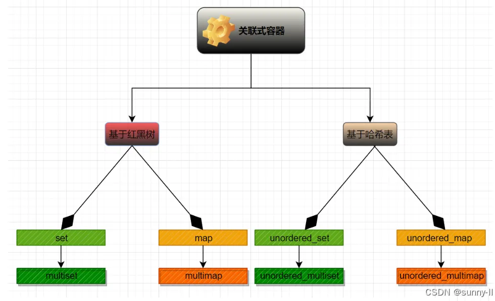

# vector

## vector简介

1.vector是将元素置于一个动态数组中加以管理的容器。

2.vector可以随机存取元素

3.vector尾部添加或移除元素非常快速，但是在中部或头部插入元素或移除元素比较费时。

## vector默认构造

vector采用模板类实现

```c++
vector<T> vecT

vector<int> vecInt;//vector左闭右开
vector<float> vecFloat;
vector<string> vecString;
...
class ca{};
vector<ca*> vecpca;
vector<ca> vecca;


```

1.vector（beg，end）
2.vector（n，elem）
3.vector(contest vector &vec)

## vector赋值

+二维初始化
```cpp
01 定义第一维固定长度为5，第二维可变化的二维数组
vector<int> v[5];//定义可变长二维数组
//注意：行不可变（只有5行）, 而列可变,可以在指定行添加元素
//第一维固定长度为5，第二维长度可以改变
//vector<int> v[5]可以这样理解：长度为5的v数组，数组中存储的是vector<int> 数据类型，而该类型就是数组形式，故v为二维数组。其中每个数组元素均为空，因为没有指定长度，所以第二维可变长。可以进行下述操作：
v[1].push_back(2);
v[2].push_back(3);

02 初始化二维均可变长数组
vector<vector<int>> v;//定义一个行和列均可变的二维数组
//应用：可以在v数组里面装多个数组
vector<int> t1{1, 2, 3, 4};
vector<int> t2{2, 3, 4, 5};
v.push_back(t1);
v.push_back(t2);
v.push_back({3, 4, 5, 6}) // {3, 4, 5, 6}可以作为vector的初始化,相当于一个无名vector

03 行列长度均固定 n + 1行 m + 1列初始值为 0
vector<vector<int>> a(n + 1, vector<int>(m + 1, 0));

04 c++17或者c++20支持的形式（不常用），与上面相同的初始化
vector a(n + 1, vector(m + 1, 0));
```

## vector访问

1.下标法：和普通数组一样。
2.迭代器法： 类似指针一样的访问 ，首先需要声明迭代器变量，和声明指针变量一样，可以根据代码进行理解

# unorderedmap

https://blog.csdn.net/weixin_45031801/article/details/142033774?ops_request_misc=%257B%2522request%255Fid%2522%253A%2522ad6680188b4db42a6b916b296ab7ccb3%2522%252C%2522scm%2522%253A%252220140713.130102334..%2522%257D&request_id=ad6680188b4db42a6b916b296ab7ccb3&biz_id=0&utm_medium=distribute.pc_search_result.none-task-blog-2~all~top_positive~default-1-142033774-null-null.142^v102^control&utm_term=unordered_map&spm=1018.2226.3001.4187

## 简介

是 STL 中的容器之一，不同于普通容器，它的查找速度极快，常用来存储各种经常被检索的数据，因为容器的底层是【哈希表】

unordered_map 是存储 <key, value> 键值对 的关联式容器，其允许通过keys快速的索引到与其对应的value。

## 构造

### 构造一个某个类型的容器 

```c++
unordered_map<string, int> um1; // 构造一个key为string类型，value为int类型的空容器

```

### 拷贝构造某个类型的容器 

```c++
unordered_map<string, int> um1({ {"apple", 1}, {"lemon", 2}});
unordered_map<string, int> um2(um1); // 拷贝构造同类型容器um1的复制品
```

### 使用迭代器区间进行初始化构造 

```c++
unordered_map<string, int> um1({ {"apple", 1}, {"lemon", 2}});
unordered_map<string, int> um3(um1.begin(), um1.end()); // 使用迭代器拷贝构造um1容器某段区间的复制品
```

## 使用

1.insert: 在unordered_ map 中插入新元素。
2. \[ ]  : 返回 key 对应的 value : 
3.find : 在容器中搜索键值等于 k 的元素
4. erase  :从 unordered_map 容器中移除单个元素或一组元素
5.size : 返回 unordered_map 中的有效元素个数 
6.empty : 检测 unordered_map 中的元素是否为空，是返回 true，否则返回 false  
7. swap : 交换 unordered_map 容器中的元素
8.count  :再容器中搜索键为 k 的元素，并返回找到的元素数 
