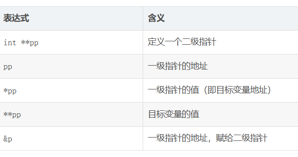

# 指针

## 指针是什么

1.指针就是地址，口语中说的指针通常是指指针变量

2.指针大小由cpu能表示的地址长度决定，与指向的数据类型无关

## 指针类型

指针类型决定了指针在被解引用的时候访问了几个字节，int是4个字节，char是1个字节

指针的类型决定了+-1操作的时候跳过几个字节

## 野指针，指针运算

野指针：指针指向的位置是不可知的。

一个局部变量不初始化的值是随机值

野指针的原因：1.没有进行初始化  2.赋值的时候超出范围  3.指针指向空间的释放  （我的理解：没有明确指针应该指向什么样的地址，所以就有了野指针）

### 指针运算

1.指针+-整数（变得是地址，但是注意指针类型）

2.指针-指针（得到的是指针之间的元素的个数，前提是指向同一块空间的2个指针才能相减）

3.指针的关系运算（核心是比较指针存储的内存地址的大小关系）

## 指针和数组

## 二级指针

定义：指向指针的指针



## 指针数组

```c
#include <stdio.h>
int main()
{
	char arr1[] = "abcdef";
	char arr2[] = "hello world";
	char arr3[] = "cuihua";

	char* parr[] = { arr1, arr2, arr3 };
	return 0;
}


```

# 结构体

结构是一些值的集合

结构体用来描述复杂对象

结构体语法声明
```c
struct tag
{
    成员变量
}
```


https://blog.csdn.net/weixin_45031801/article/details/127621419?ops_request_misc=%257B%2522request%255Fid%2522%253A%2522b20a57a1732ed963e34cee5c50d96468%2522%252C%2522scm%2522%253A%252220140713.130102334..%2522%257D&request_id=b20a57a1732ed963e34cee5c50d96468&biz_id=0&utm_medium=distribute.pc_search_result.none-task-blog-2~all~top_positive~default-1-127621419-null-null.142^v102^control&utm_term=c%E8%AF%AD%E8%A8%80%20%E7%BB%93%E6%9E%84%E4%BD%93&spm=1018.2226.3001.4187


