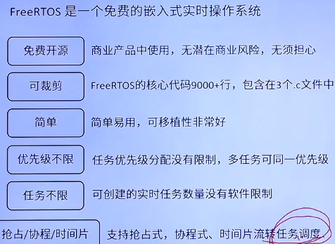
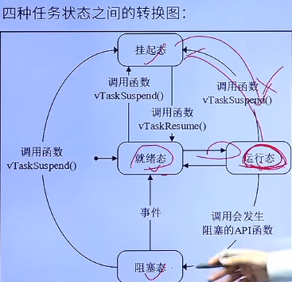

# RTOS入门

1.裸机：没有操作系统的硬件   freertos：实时操作系统

裸机：又称为前后台系统，前台系统指的中断服务函数，后台系统指的大循环，即应用程序

2.中断可以打断任意任务。

任务可以同等优先级

## freertos简介

freertos是一个免费的嵌入式实时操作系统，特点：免费开源，可裁剪，简单易用，优先级不限

# freertos基础

1.任务调度简介：使用相关的调度算法来决定当前需要执行的哪个任务

freertos一共支持三种任务调度方式：抢占式调度，时间片调度，携程式调度

## 抢占式调度

1.高优先级任务，优先执行
2.高优先级任务不停止，低优先级任务无法执行
3.被抢占的任务将会进入就绪态

## 时间片调度

一个时间片就等于SysTick中断周期

1.同等优先级任务，轮流执行，时间片流转
2.一个时间片大小，取决为滴答定时器中断周期
3.没有用完的时间片不会再使用，下次任务该时间片得到执行，还是按照一个时间片的时钟节拍运行。

## 任务状态

一共有四种状态：1.运行态 2.就绪态 3.阻塞态 4.挂起态（类似暂停）

总结：1.仅就绪态可转变为运行态
2.其他状态的任务想运行，必须先转变成就绪态

这四个状态中，除了运行态，其他三种任务状态的任务都有其对应的任务状态列表

# freertos移植
