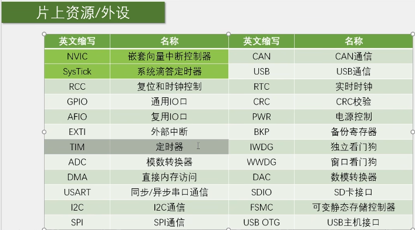
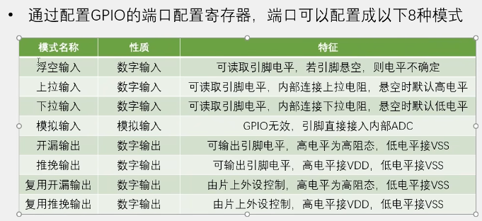

# 准备工作

STM32是ST公司基于ARMCortex-M内核开发的32位微控制器

stm32F1的所有外设


# GPIO输出




点亮第一个led灯
```c
#include "stm32f10x.h"                  // Device header

int main(void)
{
	while(1)
	{
		RCC_APB2PeriphClockCmd(RCC_APB2Periph_GPIOA,ENABLE);//开启时钟
		GPIO_InitTypeDef GPIO_InitStructure;
		GPIO_InitStructure.GPIO_Mode=GPIO_Mode_Out_PP;
		GPIO_InitStructure.GPIO_Pin=GPIO_Pin_0;
		GPIO_InitStructure.GPIO_Speed=GPIO_Speed_50MHz;
		GPIO_Init(GPIOA,&GPIO_InitStructure);//完成初始化
		
		GPIO_ResetBits(GPIOA,GPIO_Pin_0);
	}
	
}

```

led灯闪烁
```c
#include "stm32f10x.h"                  // Device header
#include "Delay.h"

int main(void)
{
	
		RCC_APB2PeriphClockCmd(RCC_APB2Periph_GPIOA,ENABLE);//开启时钟
		GPIO_InitTypeDef GPIO_InitStructure;
		GPIO_InitStructure.GPIO_Mode=GPIO_Mode_Out_PP;
		GPIO_InitStructure.GPIO_Pin=GPIO_Pin_0;
		GPIO_InitStructure.GPIO_Speed=GPIO_Speed_50MHz;
		GPIO_Init(GPIOA,&GPIO_InitStructure);//完成初始化
		
		GPIO_WriteBit(GPIOA,GPIO_Pin_0,Bit_RESET);	
	
		while(1)
	{
			GPIO_WriteBit(GPIOA,GPIO_Pin_0,Bit_RESET);	
			Delay_ms(500);
			GPIO_WriteBit(GPIOA,GPIO_Pin_0,Bit_SET);	
			Delay_ms(500);
	}
}

```