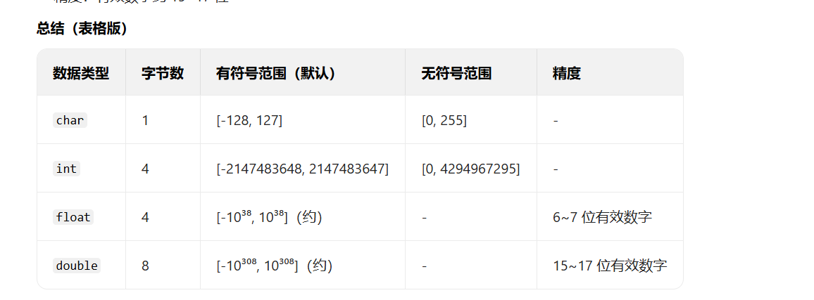
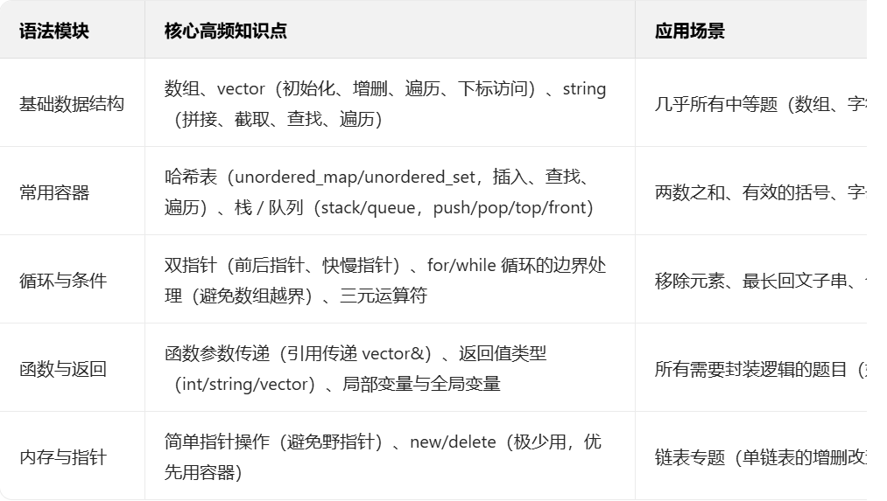

# c语言



## 联合体

### 核心特征

>内存共用：联合体中所有成员共享同一块内存空间，整个联合体的大小等于其最大成员的大小
>互斥访问：同一时间只能有效使用其中一个成员，修改一个成员会覆盖其他成员的值。

### 基本语法

```c
// 定义联合体类型
union 联合体名 {
    数据类型 成员名1;
    数据类型 成员名2;
    // ... 更多成员
};

```

## 结构体

### 内存对齐规则
1. 结构体的首地址必须是最大成员变量类型大小的整数倍
2. 每个成员相对于结构体首地址的偏移量必须是其类型大小的整数倍
3. 结构体的总大小必须是最大成员变量类型大小的整数倍

## strcpy()

strcpy() 是 C 语言标准库（<string.h>）中的字符串复制函数，用于将一个字符串的内容复制到另一个字符数组中，

```c
char dest[10];
strcpy(dest, "abc");
// 复制后 dest 的内容是 'a','b','c','\0'（后续元素未初始化）
```




